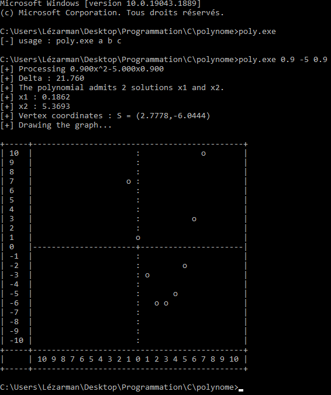

# 2D Polynomials
I was bored so i made this tool, it allows you to calculate :
* the delta
* x1, x2, x0
* vertex coordinates
* Drawing the graph

The names of the functions/variables are in French, uhh use google translate to read the code i guess, sorry for that.

# Usage 
```poly.exe a b c ```

# Screenshot

